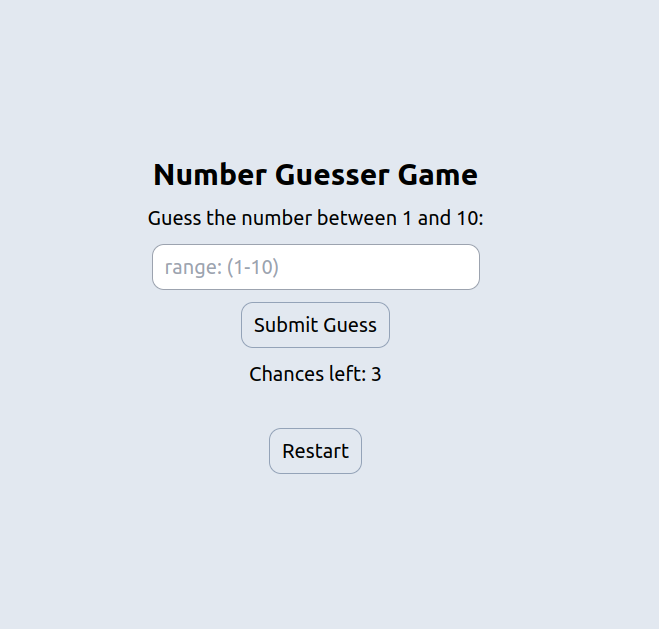

# Number Guesser Game



## Overview

This project is a JavaScript assignment developed for Bohubrihi, an online learning platform. It implements a expression validator using the following technologies:

- HTML
- JavaScript
- Tailwind CSS
- Vite for bundling
- GitHub (Version Control)
- Vercel (Deployment)

## Project Description

The Number Guesser Game project is designed to deliver an engaging and interactive Number Guesser application. Within the game, users will have the opportunity to make three guesses within a numerical range spanning from 1 to 10. It demonstrates proficiency in web development technologies and JavaScript programming.

## Features

- **Limited Guesses:** Users are restricted to three guesses, adding tension and excitement to the game while challenging their intuition and deductive skills.

- **Random Number Generation:** The game generates a random number within the 1-10 range for each session, ensuring unpredictability and replay value.

- **Feedback Mechanism:** Users receive immediate feedback on their guesses, helping them adjust their strategy and fostering an engaging gaming experience.

## How to Run

To run this project locally, follow these steps:

1. Clone the repository from GitHub:

   ```bash
   git clone
   ```

2. Navigate to the project directory:
   ```bash
   cd
   ```
3. Install project dependencies:

   ```bash
   npm install
   ```

4. Start the development server:

   ```bash
   npm run dev
   ```

## Deployment

This project is deployed on Vercel. You can access the live demo <a href="" target="_blank">here</a>.
